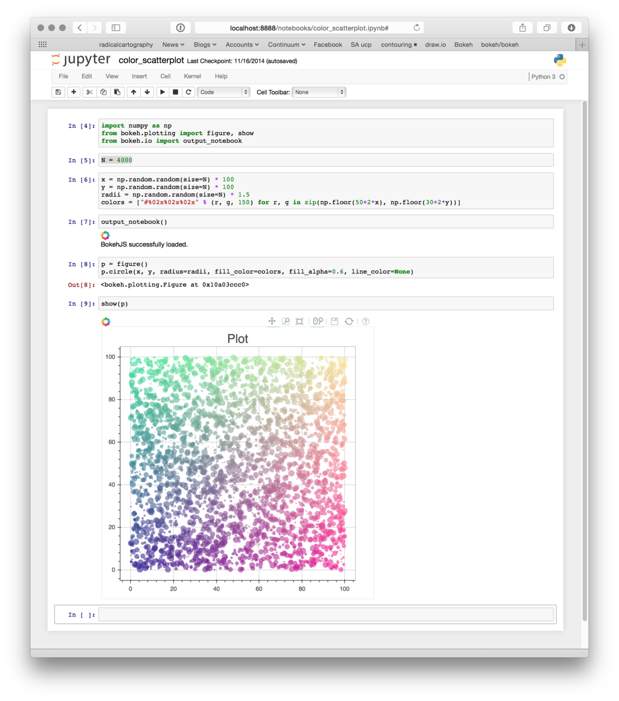

# Exercise

## Exercise 1: Neural Network
In this Exercise we will be training a Neural Network.  In Exercise two we will improve
on this network using convolutions.

1. Unzip the dataset in the repo.
2. Load the dataset with `image_dataset_from_directory`.  We need to keep a train/test split.  There are some finicky bits in loading the data. Check the hints for some sample code. 

3. Define your model  with `model = keras.Sequential([...])`, in this list you enumerate layers and finish it of with  `layers.Dense(1, activation='sigmoid')` to make a classification at the end. You will probably need to start with  `layers.Flatten(input_shape=[128, 128, 3]),` to turn every image into a single list. 

4. Compile your model with `model.compile(optimizer=tf.keras.optimizers.Adam(epsilon=0.01), loss='binary_crossentropy', metrics=['binary_accuracy',  tf.keras.metrics.F1Score()])`
5. Train your model with `model.fit`. Try to keep your train time under 5 minutes so you 
   won't need to wait too long. (See hints)
6. Try to improve your model so that it predicts better. 
    - E.g. more layers, more nodes per layer or maybe a `DropOut` layer. 
    - A score of 60-65%  (`val_binary_accuracy`) should be doable.

If you finish ahead of time you can start with the bonus exercise already. 


## Exercise 2: CNN
1. Try to make a beter model by using convolutions. Use the following layers `layers.Conv2D`, `layers.MaxPool2D`
2. Try a few different things to improve the model. A score (`val_binary_accuracy`) of 70% should be doable with a training time of 10 minutes.  

If you feel ready you can start on the bonus exercise below. 

## Bonus 1: Save, Load and run you model
1. If your model is satisfactory you can save it with `model.save`
2. You can load your model again with `keras.models.load_model`
3. You can run your model on a sample using `model(sample)`.  
   a. It may be that you need to use `tensorflow.expand_dims` to make the  dimensions of your sample match your training data. Since we trained using batches. 
4. Try to print the following next to each other:  The picture you are classifying, the verdict of your model and the correct classification. 

## Bonus 2: Graphs of training performance.
1. Save the history of your training using:  `history = model.fit`
2. Convert the history to a pandas dataframe using `  pd.DataFrame(history.history)` 
3. Plot the loss and validation loss using  `history_frame.loc[:, ['loss', 'val_loss']].plot()` 
4. Also plot the `accuracy` , `validation_accuracy`  and F1-scores. 
5. Can you see in which epoch the model started "over-fitting"

<div style="page-break-after: always;"></div>

# Hints

## Jupyter
Jupyter is a framework to run snippets of python within a shared context of variables. 
It also allows us to easily interweave code, output and plots. You don't need to use 
Jupyter to do these exercises. But it is recommended. 



You can run a Jupyter notebook from inside vscode or in your browser. If you have/know vscode I would recommend the former. 

## Dependencies
Installing dependencies on windows can be tricky, the following instructions work with python3.11

1. Clone/Fork this repo. 
2. Run `poetry instal` to create a virtual env with most dependencies installed.
3. Activate the virtual env in your command line with `poetry shell`
4. Run `pip install tensorflow` to also install tensorflow.
5. Test your environment using. `python .\test_env.py`, the output should end with "All set"
6. Start Juptyterlab using: `jupyter-lab` or open vscode then, in either, open `exercise1.ipynb` and try to run it. 
7. If this succeeds you are ready for the exercises.

## First cel of your notebook
You can start your notebook with the following cel so that you share the same defaults, useful settings and imports
with the rest of the group. 

```python
# Imports
import os
import matplotlib.pyplot as plt
import tensorflow as tf

import numpy as np

# Reproducability
def set_seed(seed=31415):
    np.random.seed(seed)
    tf.random.set_seed(seed)
    os.environ['PYTHONHASHSEED'] = str(seed)
    os.environ['TF_DETERMINISTIC_OPS'] = '1'
    return seed
seed = set_seed()

# Set Matplotlib defaults
plt.rc('figure', autolayout=True)
plt.rc('axes', labelweight='bold', labelsize='large',
       titleweight='bold', titlesize=18, titlepad=10)
plt.rc('image', cmap='magma')
```

## Loading data
Loading data the right way can be finicky and it is not always clear when you did it 
wrong.  To help everybody get underway we share the following snippet

```python
def convert_to_float(image, label):
    image = tf.image.convert_image_dtype(image, dtype=tf.float32)
    return image, label


def load_data(seed):
    ds_train, ds_test = image_dataset_from_directory(
        './dataset/train/train',
        labels='inferred',
        label_mode='binary',
        image_size=[128, 128],
        interpolation='nearest',
        batch_size=64,
        shuffle=True,
        validation_split=0.2,
        subset="both",
        seed=seed
    )

    ds_train = (
        ds_train
        .map(convert_to_float)
        .cache()
        .prefetch(buffer_size=tf.data.experimental.AUTOTUNE)
    )

    ds_test = (
        ds_test
        .map(convert_to_float)
        .cache()
        .prefetch(buffer_size=tf.data.experimental.AUTOTUNE)
    )

    return ds_train, ds_test
``` 

## Model training time
If your model is taking too long to train, there are a few things you can do:
- Investigate and reduce the number of trainable parameters in the model. (Use `model.summary()` to see where they are.)
- Reduce number of epochs. Especially if you train for a long time, without the model improving.
  - Even better is the use of: https://keras.io/api/callbacks/early_stopping/
- Reduce the size of the training set
